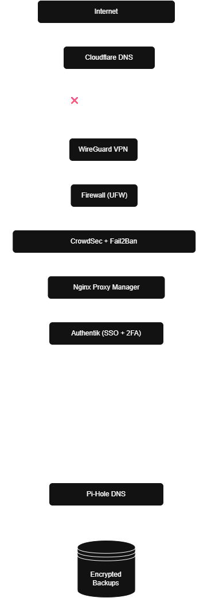

# 🏠 Self-Hosted Homelab (Security-First)

A zero-trust, self-hosted personal cloud built using Docker, VPN-only access,
central authentication, and open-source tools.

## ✨ Features
- VPN-only access using WireGuard
- Central authentication with Authentik (SSO + 2FA)
- Reverse proxy with HTTPS
- Media automation stack (ARR)
- Cloud, documents, photos, and backups
- Intrusion prevention and monitoring

## 🧱 Core Principles
- No public admin panels
- No plaintext secrets
- Everything behind VPN + SSO
- Backups are mandatory

## 📐 Architecture

## 📚 Documentation
- [Architecture](docs/architecture.md)
- [Security Model](docs/security.md)
- [Networking](docs/networking.md)
- [Backups](docs/backups.md)
- [Monitoring](docs/monitoring.md)

## 🚀 Services Overview
See full service list below 👇
